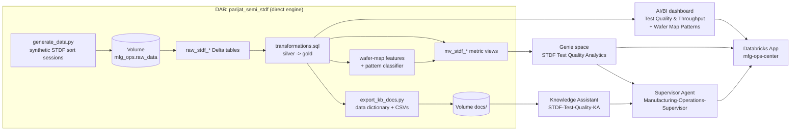

# Manufacturing Operations Center: Design Document

**Owner:** Parijat Bhide (Sr. SA, MFG Tech West)
**Workspace:** `e2-demo-field-eng` (CLI profile `e2-demo-fe`)
**Repo:** `parijatbhi-db/manufacturing-operations-center` (`bundle/` and `app/`)
**Status:** Live demo, last rebuilt 2026-10-05

---

## 1. Purpose

This is an end-to-end semiconductor test-analytics demo on Databricks. It takes STDF (Standard Test Data Format) wafer-sort results and turns them into:

- yield, bin, parametric-drift and throughput KPIs;
- wafer-map spatial pattern classification;
- a governed semantic layer (Unity Catalog metric views);
- self-service analytics (AI/BI dashboard and Genie);
- an AI supervisor agent that combines live SQL answers with document-grounded context.

It is all surfaced in one Databricks App, the **Manufacturing Operations Center**.

The story is a realistic yield excursion. A fictional company, KARI Semiconductor Ops, installs a new probe card revision and handler firmware at its Austin site. Product MX-7 then loses about 7 FPY points over 10 days. The demo traces that loss from symptom (FPY dip) to signature (Edge-Ring wafer maps, HB_021 open/short bins, PT_0210 contact-resistance drift). It then follows it to root cause (dated change-log entries on TST-AUS-03..05 with probe card PC-AUS-447) and to business impact (lost dies and dollars).

### Design goal: one pipeline is the single source of truth

Every downstream asset is produced or configured by **one Databricks Asset Bundle**, and it all lives in **one schema, `parijat_demos.mfg_ops`**:

- tables;
- metric views;
- the Knowledge Assistant (KA) corpus;
- the dashboard and Genie space definitions;
- the agent wiring.

Nothing is hand-built in the UI, so re-running the job rebuilds the whole demo consistently.

---

## 2. Architecture



### Job: `[DEMOGEN] - semi_stdf - Data Generation and Transformation` (id `848871296768056`)

| # | Task | Compute | What it does |
|---|------|---------|--------------|
| 1 | `generate_data` | Serverless Python | Simulates about 1,200 wafer-sort sessions (Jun 15–Oct 5 2025) and writes parquet plus `raw_stdf_*` Delta tables |
| 2 | `sql_transformations` | SQL warehouse `parijat-mfg-ops` | Builds the silver and gold layers, wafer-map features and classification, and seven metric views. Parameterized by `catalog` / `schema` |
| 3 | `export_kb_docs` | Serverless Python | Regenerates the KA corpus (data dictionary from UC table comments, columns and sample rows, plus gold CSV extracts) |
| 4 | `sync_agent_bricks` | Serverless Python (`databricks-sdk>=0.55`) | Points the KA at the regenerated docs (swapping out stale sources) and re-syncs it. Creates the MAS if it is missing |

### Bundle-managed resources

| Resource | Key | ID / name |
|---|---|---|
| Schema | `mfg_ops` | `parijat_demos.mfg_ops` |
| Volume | `mfg_ops_raw_data` | `parijat_demos.mfg_ops.raw_data` |
| SQL warehouse | `mfg_ops_wh` | `parijat-mfg-ops` (`50cb0e5f102813f0`), 2X-Small serverless, 10-minute auto-stop |
| Job | `demo_workflow` | `848871296768056` |
| Dashboard | `test_quality_ops` | `01f13ffb2116152b9c57017ac6989369` |
| Genie space | `stdf_genie` | `01f1403396011f339af2cb207b69e9b6` |

### Managed by the job, not by DAB resources

The bundle has no resource type for these, so the `sync_agent_bricks` task manages them:

| Asset | ID | Endpoint |
|---|---|---|
| Knowledge Assistant `STDF-Test-Quality-KA` | `b49c04e7-8a4b-4c5e-b7a9-6422165f5516` | `ka-b49c04e7-endpoint` |
| Supervisor Agent `Manufacturing-Operations-Supervisor` | `40863b57-1699-430c-8335-ee6db4a0c691` | `mas-40863b57-endpoint` |

**App:** `mfg-ops-center`, at https://mfg-ops-center-1444828305810485.aws.databricksapps.com. It is built with React + Vite + Express and deployed separately from `app/`. It has three tabs: Dashboard (embedded), Genie (on-behalf-of user) and Supervisor Agent (on-behalf-of user).

---

## 3. Data model (`parijat_demos.mfg_ops`, 34 objects)

### Raw (written by `generate_data`)

| Table | Grain | Notes |
|---|---|---|
| `raw_stdf_raw_prr_parts` | One row per die per sort session (565,856 rows) | STDF PRR: die X/Y coordinates, hard/soft bin, pass/retest flags, tester, probe card, handler, program |
| `raw_stdf_raw_ptr_params` | One row per die × parameter (487,320 rows) | STDF PTR: PT_0210 contact resistance, PT_0217 IDDQ, PT_0103 Vth margin, PT_0301 |
| `raw_stdf_raw_lot_wafer_master` | One row per wafer (1,200) | Lot, foundry, expected dies, start date |
| `raw_stdf_raw_equip_change_log` | One row per change (29) | ECRs, including the 08-18 onset and the 08-24 rollback |
| `raw_stdf_raw_wafer_review_labels` | One row per reviewed wafer (521) | Yield-engineer pattern labels; ground truth for classifier QA |

### Silver

- `silver_stdf_prr_parts`: standardized enums, date/week columns, `die_x`/`die_y`.
- `silver_stdf_ptr_params`: z-score against the pre-event baseline (Jul 28–Aug 17), Cpk, limit breach.
- `silver_equip_change_log`, `silver_lot_wafer_master`, `silver_time_spine`.
- `silver_wafer_sort_sessions`: one row per wafer, with sort start/end, equipment, wafer yield and die-grid geometry.
- `silver_wafer_review_labels`.

### Gold: yield and operations

| Table | Purpose |
|---|---|
| `gold_test_kpis_daily` | FPY, dies tested/passed/failed, retest rate and trailing-21-day FPY baseline by date/site/product/foundry |
| `gold_bin_mix_weekly` | Top-5 failure hard bins per site/product/week |
| `gold_param_drift_timeseries` | Daily mean z-score and limit-breach rate per parameter |
| `gold_throughput_daily` | UPH from tester active spans |
| `gold_change_log` | Change log for correlation |
| `gold_impact_cumulative` | Cumulative MX-7 lost dies and cost against baseline ($15 per lost die + $0.35 per retest) |
| `gold_counter_*`, `gold_filters_bridge` | Dashboard helper tables |

### Gold: wafer maps

| Table | Purpose |
|---|---|
| `gold_wafer_map_dies` | Die-level map: `die_x`, `die_y`, `r_norm` (0 = center, 1 = edge), `theta`, radial zone, bin label |
| `gold_wafer_patterns` | One row per wafer: spatial features, `pattern_class`, `likely_cause`, sort context and engineer label |
| `gold_wafer_pattern_weekly` | Wafer counts, average yield and failed dies by week/site/product/pattern |
| `gold_wafer_pattern_eval` | Confusion matrix of classifier vs engineer label |

### Metric views (Genie data sources)

`mv_stdf_test_yield`, `mv_stdf_failure_bins`, `mv_stdf_param_drift`, `mv_stdf_throughput`, `mv_stdf_business_impact`, `mv_stdf_equipment_changes` and `mv_stdf_wafer_patterns`.

FPY and retest rate are defined as die-weighted ratios: `SUM(dies_pass_fp)/SUM(dies_tested)` rather than an average of daily ratios.

---

## 4. Synthetic data design

### Wafer-sort simulation

Each wafer is probed in **one sort session** on one tester, probe card and handler. Every die on a circular grid is tested in serpentine order, so each wafer has a complete wafer map, which is what pattern classification needs.

| Product | Grid radius | Dies per wafer | Index time per die |
|---|---|---|---|
| MX-5 | 12 | ~450 | 5.0 s |
| MX-7 | 13 | ~530 | 5.5 s |
| RF-22 | 11 | ~380 | 6.5 s |

Volume is about 5,200 dies per weekday, with weekend dips. Business-hour start times follow a site/product volume mix in which AUS MX-7 is the heaviest.

### Failure model

For each die, the kill probability combines two components:

```
p_fail(x, y) = 1 - (1 - p_random) * (1 - amplitude * shape_pattern(x, y))
```

- **Random defects:** `p_random` is set from the site/product FPY baseline (93.9–96.7%).
- **Spatial pattern:** each wafer draws one pattern from the baseline mix:

  | Pattern | Share of wafers |
  |---|---|
  | None | 72% |
  | Center | 5% |
  | Edge-Loc | 5% |
  | Random | 5% |
  | Loc | 4% |
  | Donut | 3% |
  | Edge-Ring | 3% |
  | Scratch | 3% |

  Each pattern has its own shape function: a Gaussian at the center, a ring at mid-radius, a sigmoid at the edge, an edge arc, an interior blob, or a line segment.
- **Bins:** pattern kills carry the mechanism's dominant hard bin. Edge patterns map to HB_021 (open/short), Center to HB_014 (IDDQ), Donut to HB_032 (Vth), and Loc/Scratch to HB_007 (functional).

### The incident

| | |
|---|---|
| **Trigger** | 2025-08-18 07:30. Probe card PC-AUS-447 Rev C and handler firmware HF-3.2.1 installed on TST-AUS-03..05 |
| **Scope** | During the window, 85% of AUS MX-7 wafers are routed to those testers. F12 focus lots MX7-F12-W27..W29 are in sort |
| **Signature** | Forced Edge-Ring pattern (amplitude 0.33–0.39). HB_021 dominates. PT_0210 rises by up to 2.4σ, scaled toward the wafer edge. Retest share and probe index time go up |
| **Recovery** | 2025-08-24 22:15. Firmware rollback to HF-3.1.9 and probe card reconditioned. Severity ramps down linearly to Aug 27, then a faint residual to Sep 1. Retests and parametric drift scale with severity |

**Measured outcome** (latest run):

| Metric | Baseline | During incident |
|---|---|---|
| AUS MX-7 FPY | 95.4% | 88.3% (daily low 86.5% on 08-19) |
| HB_021 share | 1.5% | 8.7% |
| Retest rate | 2.5% | 9.5% |
| AUS MX-7 UPH | ~590 | ~400 |

Incident cost is about 1,100 additional lost dies and about $17.6K over Aug 18–27.

---

## 5. Wafer-map pattern classification

The classifier is a deterministic, explainable rule set implemented in SQL (`gold_wafer_patterns`). The pattern classes follow the **WM-811K** taxonomy.

### Features (per wafer)

| Feature | Meaning |
|---|---|
| Zone fail rates | Center (r<0.35), inner (0.35–0.65), outer (0.65–0.82) and edge (≥0.82) of the normalized radius |
| `spatial_chi2_ratio` | Chi-square dispersion of fail counts across 25 ring/sector cells. About 1 means spatially random |
| `n_clustered_fail` | Failing dies with ≥2 failing 8-neighbors (filters out isolated random defects) |
| `cluster_excess` | Clustered fails divided by the count expected from random defects at the same fail rate |
| `clustered_mean_r` | Mean normalized radius of clustered fails |
| `clustered_elongation` | Ratio of principal-axis variances of clustered fails (high for scratches) |
| `edge_fail_angular_conc` / `inner_fail_angular_conc` | Mean resultant length of fail angles (0 = spread out, 1 = one direction) |

### Decision rules (in order)

1. A fail rate of ≥50% is **Near-full**.
2. Fewer than 5 clustered fails, or no spatial structure (chi² < 2 **and** cluster excess < 2), gives **Random** if the fail rate is ≥8%, and **None** otherwise.
3. If clustered fails sit at the edge (mean r ≥ 0.75), the result is **Edge-Loc** when they are angularly concentrated (≥0.5) and **Edge-Ring** otherwise.
4. Elongated clusters (elongation ≥15, ≥6 dies) are **Scratch**.
5. If the center zone has the highest fail rate and the clusters are central, the result is **Center**.
6. A mid-radius ring that is not angularly concentrated is **Donut**.
7. Anything else is **Loc**.

### Accuracy vs engineer labels

Agreement is 93.1% across 521 reviewed wafers.

| Label | Correct / reviewed |
|---|---|
| None | 338 / 346 |
| Edge-Ring | 37 / 40 |
| Edge-Loc | 33 / 34 |
| Center | 26 / 30 |
| Random | 21 / 25 |
| Donut | 14 / 17 |
| Scratch | 7 / 8 |
| Loc | 9 / 21 (weakest; near-center blobs are called Center) |

Of the incident wafers, 28 of 31 on TST-AUS-03..05 are classified Edge-Ring, and all 28 ran on probe card PC-AUS-447.

### Why rules rather than ML (for now)

- **Explainable:** every class traces to named features that a yield engineer recognizes, and the reasoning is visible in SQL.
- **No model ops:** classification is just another gold table, so there is nothing to train, register or serve. The pipeline stays a single SQL step.
- **Ready for an ML upgrade:** `gold_wafer_map_dies` plus `silver_wafer_review_labels` already form a labeled training set. A next step is a CNN or gradient-boosted classifier tracked in MLflow, registered in UC and scored as a pipeline task, with `gold_wafer_pattern_eval` as the comparison harness.

---

## 6. AI and BI layer

### AI/BI dashboard ("Semiconductor Test Quality and Throughput")

It has three pages:

1. **Global Filters:** date, site, product, foundry, tester and wafer.
2. **Test Quality and Throughput:**
   - KPI counters;
   - FPY by date;
   - failure-bin mix;
   - parameter drift;
   - cumulative impact;
   - change-log table.
3. **Wafer Map Patterns:**
   - wafers sorted, patterned-wafer rate and Edge-Ring count;
   - weekly pattern mix;
   - patterned wafers by tester;
   - die-level wafer-map scatter, with a wafer selector that defaults to `MX7-F12-W27-W01`;
   - patterned-wafer table with likely cause;
   - classifier vs engineer table.

The dashboard is deployed and published by the bundle on warehouse `parijat-mfg-ops`.

### Genie space ("STDF Semiconductor Test Quality Analytics")

- **Data sources:** the seven metric views.
- **Instructions:** sites, products, incident facts, formatting rules, wafer-pattern semantics, and a reminder to use `MEASURE()` with metric views.
- **Examples:** 10 example SQLs, all verified to execute, and 8 sample questions.
- **Source:** the definition lives in `bundle/src/stdf_genie.geniespace.json`.

### Knowledge Assistant (`STDF-Test-Quality-KA`)

- **Source:** a single knowledge source, "STDF Reference Docs (parijat_demos.mfg_ops)", reading `/Volumes/parijat_demos/mfg_ops/raw_data/docs`.
- **Corpus:**
  - a data dictionary covering incident context, bin and pattern definitions, and every gold table's comment, columns and sample rows;
  - CSV extracts of the KPI, change-log, drift, impact and wafer-pattern tables.
- **Refresh:** regenerated on every run, so it can't drift from the data.

### Supervisor Agent (`Manufacturing-Operations-Supervisor`)

It routes questions to the right agent:

- quantitative questions (yield, throughput, bins, wafer-map patterns) go to Genie;
- definitions, documentation and incident context go to the KA.

---

## 7. Deployment and operations

### Routine update

```bash
cd bundle
databricks bundle deploy -p e2-demo-fe
databricks bundle run demo_workflow -p e2-demo-fe
```

A full run takes about 25 minutes, most of it the KA endpoint coming back to ACTIVE.

### Fresh workspace bootstrap

The Genie API rejects tables that don't exist yet, so the first deploy needs two passes:

1. Temporarily replace `${resources.genie_spaces.stdf_genie.id}` in `databricks.yml` with a placeholder, and comment out `include: resources/*.yml`.
2. Deploy and run the job.
3. Restore both changes and deploy again.

### Known gotchas

- **Remote dashboard edits:** UI edits make `bundle deploy` require `--force`. Pull the remote definition into `dashboard_test_quality_ops.lvdash.json` first, so nothing is lost.
- **KA source names:** they must be unique per KA. The sync script derives the name from the docs path and creates the new source before deleting stale ones.
- **App OAuth scopes:** `dashboards.genie` and `serving.serving-endpoints` need one-time user consent. To force a re-prompt, revoke the stale grant with `DELETE /api/2.0/oauth-app-integrations/<id>/user-consent/me`.
- **Deployment engine:** the bundle uses the **direct** engine, because the Terraform engine can't manage Genie spaces.

---

## 8. Design decisions

| Decision | Rationale | Trade-off |
|---|---|---|
| One schema (`mfg_ops`) owned by one bundle | Single source of truth and reproducible rebuilds | Older ad-hoc objects were dropped |
| Catalog/schema as bundle variables, passed as task and SQL parameters | Retarget the whole demo with one variable | The Genie JSON keeps fully-qualified names, which Genie requires |
| Whole-wafer sort sessions instead of random die sampling | Gives real wafer maps and realistic UPH (~600 vs ~2 before) | About 1.7× more PRR rows |
| Rule-based SQL classifier | Explainable, no model ops, runs in the SQL task | Loc accuracy is weaker. ML is the planned upgrade |
| KA corpus generated from UC metadata | Docs can't drift from tables | The data dictionary is generic rather than hand-written prose |
| Bind existing Genie, KA and MAS IDs instead of recreating them | The app, MAS wiring and OAuth consent keep working | Requires the direct engine and a two-pass bootstrap |
| Die-weighted FPY measure | Correct aggregation across foundries and days | Differs slightly from naive averages in older screenshots |

---

## 9. Limitations and next steps

- **Data:** the data is synthetic (no real STDF parsing). The workspace has a separate `parijat_demos.manufacturing.stdf_input` volume of binary `.stdf` files that could feed a real parser (e.g. pySTDF on Lakeflow) into the same `raw_stdf_*` contract.
- **Business impact measure:** `mv_stdf_business_impact` uses `MAX()` over per-site cumulative columns. It is correct only when grouped by site, and should be rebuilt on a daily (non-cumulative) loss table.
- **ML classifier:** train one on `gold_wafer_map_dies` + labels and compare it in `gold_wafer_pattern_eval`.
- **Alerting:** add SQL alerts or Lakehouse Monitoring on daily Edge-Ring rate per probe card, which would have flagged PC-AUS-447 within hours.
- **Spatial drill-through:** link a wafer row in the dashboard to the map, and add PT_0210 die heatmaps per wafer.
